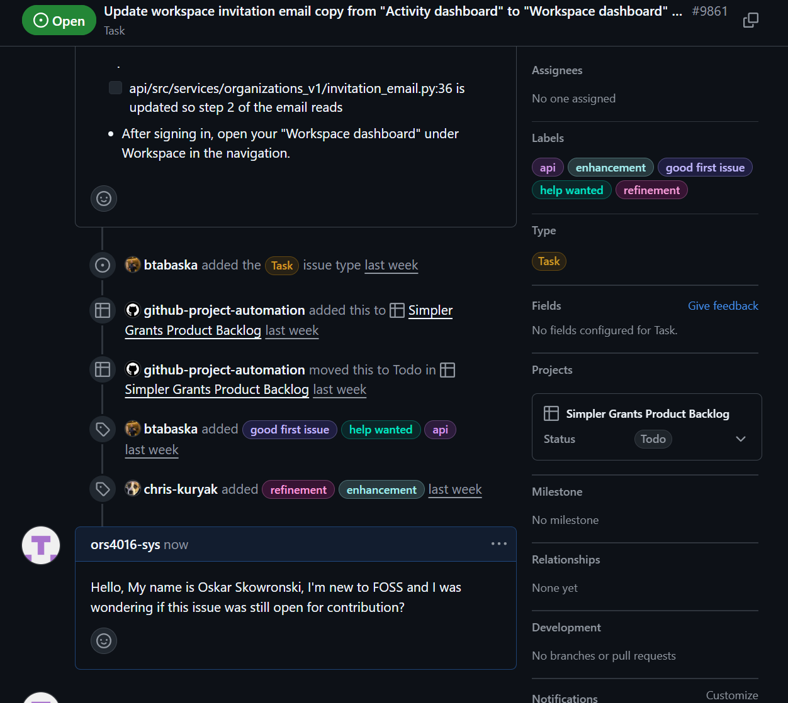
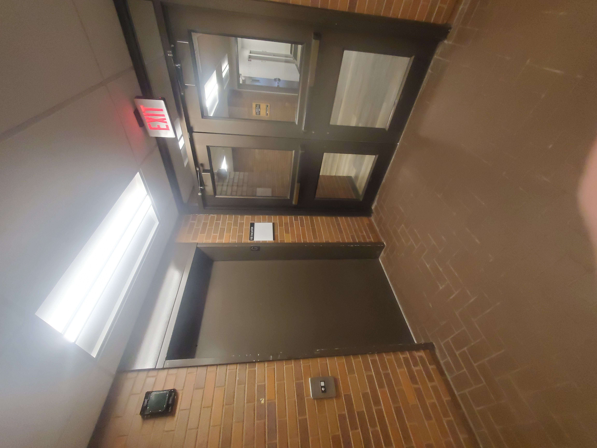
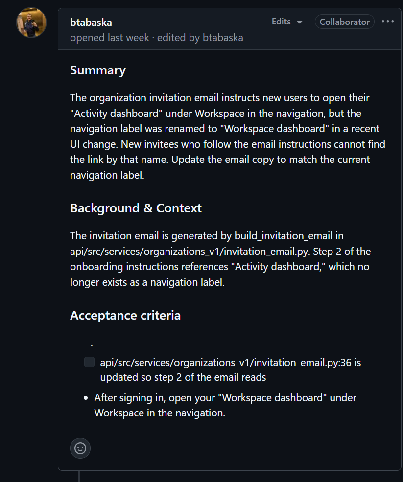

# OS Second Contribution (and 3rd?)

For my Second contribution to the open source community, I decided to continue helping the campuspulse.access site at RIT with cataloguing accessibility options across campus.

Additionally, I decided to try and contribute to the [Simpler Grants Site](https://github.com/HHS/simpler-grants-gov/issues/9861) incentive, as I believe their documentation to be easily accessible.

## Why [Campuspulse.access](https://access.campuspulse.app/catalog)/[simplergrants.gov](https://github.com/HHS/simpler-grants-gov/issues/9861)?

For campusPulse, my reasons for contribution have not changed:
1. User turnover: The site is hosted by RIT FOSS club, which is constantly in need of fresh contributors due to graduating students.
2. Easy accessibility: The site is hosted directly by RIT, and already has a lot of people I am familiar with.
3. Smaller scale project: The idea of joining a larger scale project, such as Red Hat contributions is daunting, and I would need extra time to learn the infrastructure I'd be working on, as well as the commit guidelines.

Rather than state what I did in my previous post, because not much has changed, (i.e. vague guidelines unless instructed by Adrian,) I'd like to add that, work cataloguing buttons and elevator's has been quite slow.  Since I chose to help on crowd sourcing, I've documented all the buttons across only two buildings, and it took a lot of time and a lot of walking to get all of the photos 

 

As for simplergrants, it was one of the project that was talked about in class, and I was particularily inspired by how well catalogued all of their documentation was, with little tags denoting what commits were good options for first contributions.
Other students had also mentioned doing contributions for them before, which made me very comfortable asking to contribute outright.

## Contribution History

Overall activity has been progressing, though since I'm leaving campus soon, I don't know if I can catalogue many other buildings. The submission form for buttons is still not-recommended, so I'm continuing the button documentation on my google drive. The next step would be to learn how to convert all of the button documentation to the site. 

So far I've catalogued all of the buttons I found on both floors of Hugh L. Carrey Hall and James E. Booth, with both uploaded to the google doc. My only worry is that these contributions may overlap with other students, as the buttons to be catalogued table is not being updated currently.

Hopefully my cataloguing has all of the information necessary about each button and each floor, I've been labelling them based on floor and adjoining rooms, if the door doesn't have a distinct label on the floor plan.

I haven't had much time to contribute to the SimplerGrants project yet, but I have forked their repository, all that's left is to get it working properly so that I can edit the email notification generated by their api for new joiners.

It's not much but hopefully my help will contribute to making this less monotonous for those in the futuer of these projects ¯\\\_(ツ)\_/¯.

