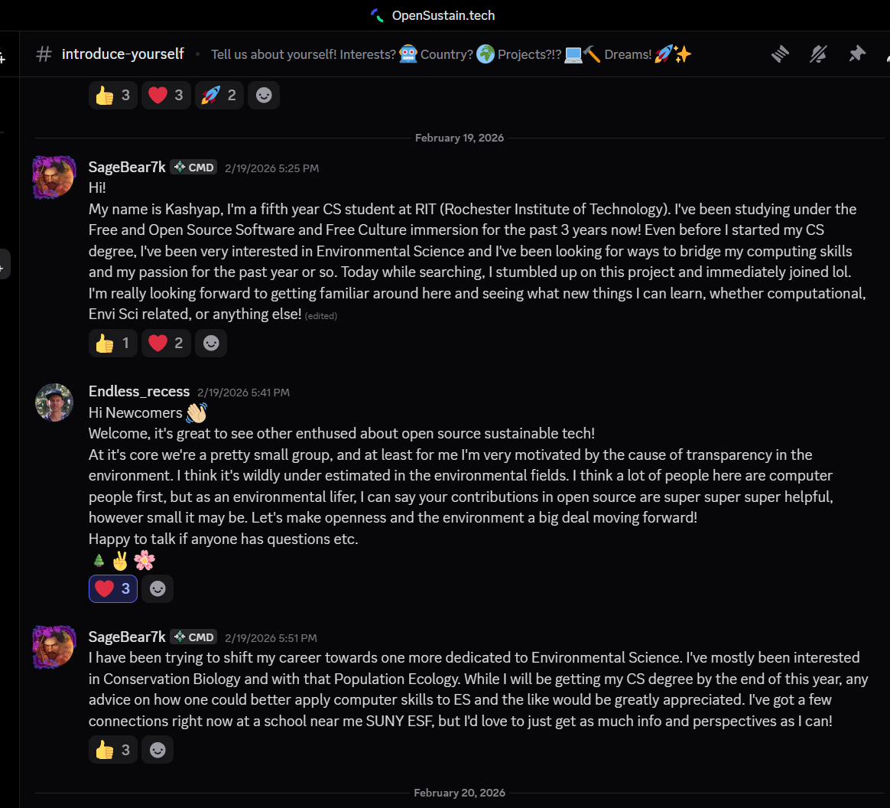
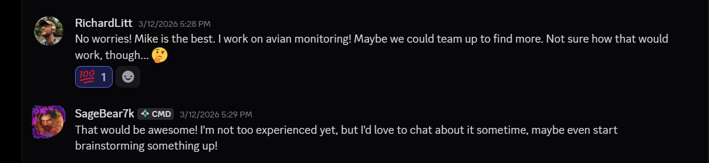
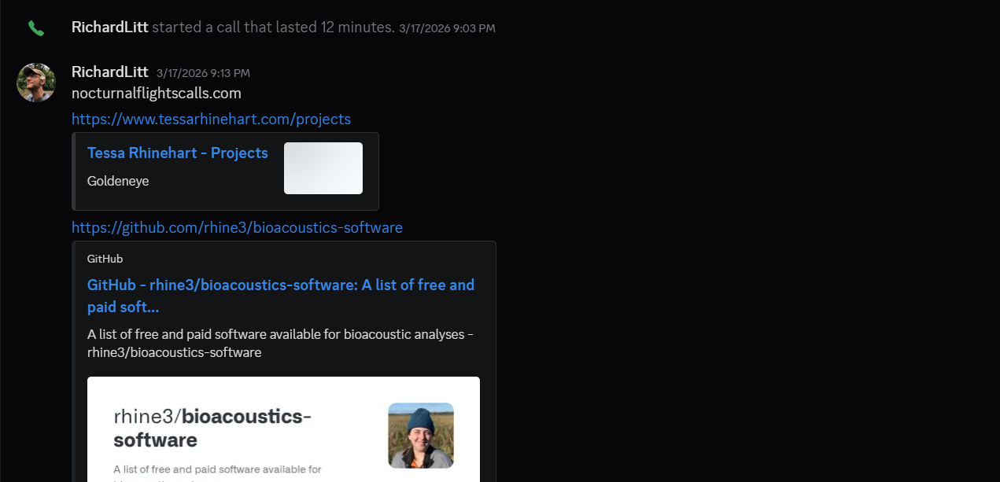

# Navigating Networking Through Open Source
By: Kashyap Bendapudi
---

# Introduction: Who am I?
___

Hey there! My name is Kashyap Bendapudi!

I am a 5th year computer science student from RIT and I'm currently
studying OSS as an immersion!

So far my journey through CS has been a rollercoaster of emotions
from the classic imposter syndrome to succeeding in ways I never
imagined possible. For me Computer Science was never an innate choice,
I was heavily influenced by those around me and when it came time to apply
for colleges I felt like I just had to go to school for Comp Sci, I couldn't
imagine myself doing anything else, simply because it felt like the "correct" choice.

Fast forward to my sophomore year, I absolutely hated it. I hated the work,
the material, the coding, the absolute everything. But the one thing that kept me motivated?
The people. At the time I had joined RITSEC, once again because I was influenced! During that time
I joined a mentorship program being run by Olivia Galluci and Michael Vaughan about something called Open Source.

Of course I only joined because it would look good on my resume, but little did I know that would be the seed planted
in my brain that helped me  change the way I looked at everything I've done at school.

Over the course of the semester I learned the basics of Open Source, and even started getting involved in 
communities related to OSS, one specific one was Brave Browser. Though I didn't linger too long as I found it
difficult to stay motivated at all that semester due to an abundance of personal problems which killed absolutely
any will to try and commit. Unfortunately I left that group of people before the program could complete, but I did
leave with two great connections, my first professional connections in fact!

During my third year, I had declared my immersion as FOSS, and got the great opportunity to take a class with
Amit Ray introducing me to the ethical and philosophical side of computing culture, something I didn't even think was existent in this sphere.

After my third year, I decided to take a leave of absence from school, due to specific academic pressures and the overall
idea that I wasn't happy with the education and experience I was getting at RIT. I was alone, scared, tired, and just on the brink
of giving up. That was until I was offered an internship through a little thing we call nepotism. This internship
would see me spending my next two semesters in India working for a private company, and during that time was when I got to see Open Source research in action.
I was given the opportunity to introduce different Open Source projects related to encryption and also spent a lot of time just learning
for the sake of learning, because I saw the direct impact of what I learned to the people around me.

All of this helped me refocus myself both as a person and as a student. I used what I learned and came back to school as a different person and now I'm completing my last year.

All of this to say, what does this have to do with networking and open source and stuff?

Well, I need y'all to know who I even am before I start talking about what I've been doing now!

This very long blog post is an assignment for my HFOSS class where we are supposed to show off our first contributions to an OSS project, but you might be able to tell
that this post isn't going in that direction. After speaking to my professor, Jess Liebermann, I got permission to use my "first contribution" to talk about
my journey so far in looking for projects and people to help me find what I will do next after graduating.

# The Actual "contribution"

For many years, I have always held a special place in my heart for animals. Most of my youth I spent my time
reading about wildlife, dinosaurs, insects, birds and all of that. To the point where I was sure I'd become an
Ornithologist, Paleontologist, or a Zoologist. Obviously that isn't the case, yet? But during most of my time in school,
I genuinely feared pursuing any of those passions, because it felt wrong in a weird way. But this semester, I got fed up
with that thinking, I knew I needed to take some action if I wanted to take control of my life, because I remembered one of the central
teachings in the Bhagavad Gita: "Do your duty, but don't worry about the outcome". Not a perfect translation since the Gita was written in Sanskrit.
But regardless, I started talking to my professors this semester, just asking simple questions, fortunately I was also able to get
into a Environmental Science class this semester so I had at least one professor, Nathan Kiel, who I could seek advice from.

The first professor I spoke to however, was Jess, and she immediately jumped at talking to me more about this. And frankly, if it werent for her
shared excitement, I probably wouldn't have made the progress I have today. But Jess got me back in touch with Amit Ray, her husband, and through a simple
conversation with him I was able to be introduced to RIT alumn, Mike Nolan. At the same time, Jess and Dr.Kiel, got me in touch with another RIT Faculty, Dr.Karl Korfmacher.

After convsersing with Mike and Dr.Korfmacher where all I did was share my passion and position, they got me in touch with EVEN more people. From Dr.Korfmacher I was able to speak to 
Gregory Babbitt, another RIT alumn who got me involved in an Open Source community called the [Earth Species Project(ESP)](https://earthspecies.org/)!

The most memorable part of this journey so far would have to be the week after my initial ZOOM call with Mike Nolan.
You see, around a month before meeting and being introduced to Mike, I joined an OSS community called [OpenSustain.tech](https://opensustain.tech/). I made my intro message and then just left it at that
as work began piling up at school. Come the day after my meeting with Mike, I suddenly get pinged on the OpenSustain discord server by a user RichardLitt who claimed to know people at
RIT and even called out Mike Nolan and SJ! Of course I was surprised that this random server I decided to join just happened to have a guy who knew RIT folks. I immediately
reached out to Richard Littauer and introduced myself, then the next week we had a short call with him on discord for advice and even a project idea!

The following Friday, I found out Mike Nolan was in town and got invited to a lunch with him and Professor Ray, we were also accompanied by a classmate, Olivia Croteau.
During that lunch, I mentioned the whole meeting Richard and then Mike suggested reaching out to someone with the last name of Snyder from the Seneca Park Zoo. I spent that weekend
trying to find this person and had a couple of hits, but wasn't confident on exactly who to reach out to. The following week, on Thursday March 26th, we had another guest speaker, Tom Callaway, come in.
SJ also sat in on this lecture, and after the lecture was over and the class conversed, I mentioned my recent efforts to find a path from CS to basically anything animal/conservation related,and SJ spoke up
and offered me a connection. Tom Snyder at the Seneca Park Zoo, Director of Conservation Advancement, the missing piece of my puzzle. I got in touch with Tom that weekend
and just recently had a ZOOM call with him on April 3rd 2026. And as a result of that meeting, Tom offered me an opportunity to work with him and the zoo on a project!

So there it is, that's my blog post. I hope I didn't write too much but I'm very excited for the future. Below I'm going to provide screenshots of some of the calls or connections, but in the future
I'll remember to grab pictures of me meeting all these amazing people!

My Intro to the OpenSustain Community

Initial interaction with Richard

My Intro to the ESP Community