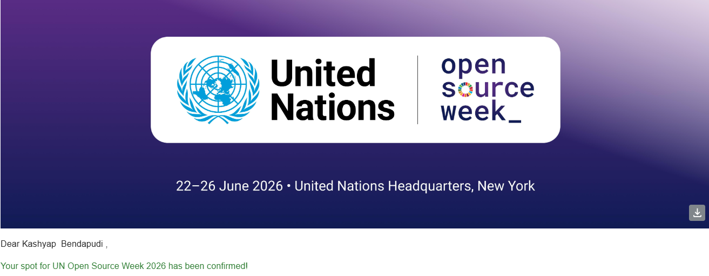
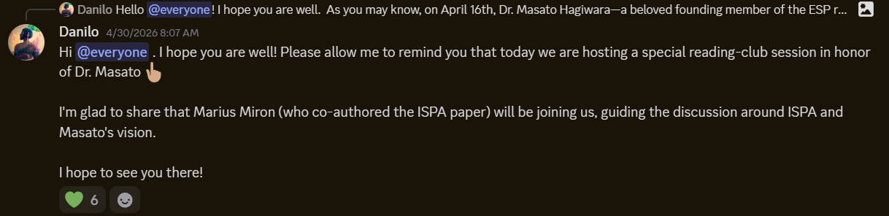

# Networking Outcomes Through Open Source
By: Kashyap Bendapudi
---

# The Contribution and Next Steps

As you know I had spent most of my time this semester looking for opportunities in Open Science or 
Environmental Science that combine my computing skills and such. With that time, I made many connections
and they led me to many routes for applying my skills. Two of which have slowly shown some promising potential,
The UN Open Source Week of 2026 and working on a project for the local Zoo as a volunteer. Through connections
like Mike Nolan and Tom Callaway I was able to get into the UN Open Source week! And now I am working on a conservation
project with the zoo. Apart from working on the actual project, my primary goal is to make more connections and meet even more
people. Besides these two main things, I have been getting a bit more involved with the ESP project, this summer I will be attending
some reading events that are hosted on the communities discord. We actually experienced a loss in that community recently. Dr. Masato Hagiwara
passed from a long battle of cancer. Though I never interacted with him, I did see how the community reacted to such a loss, and I got to experience
first hand how immense just one individuals impact can have on such a large project.

In the future, depending on how I go and navigate these new opportunities, I know I will be keeping in touch with RITs FOSS
community and many professors, like Jess.

UN Open Source Confirmation

ESP Reading Club