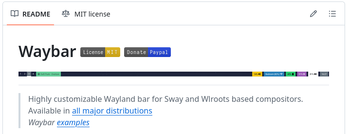
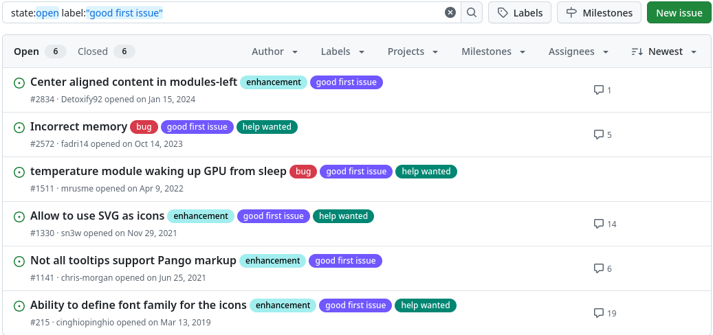
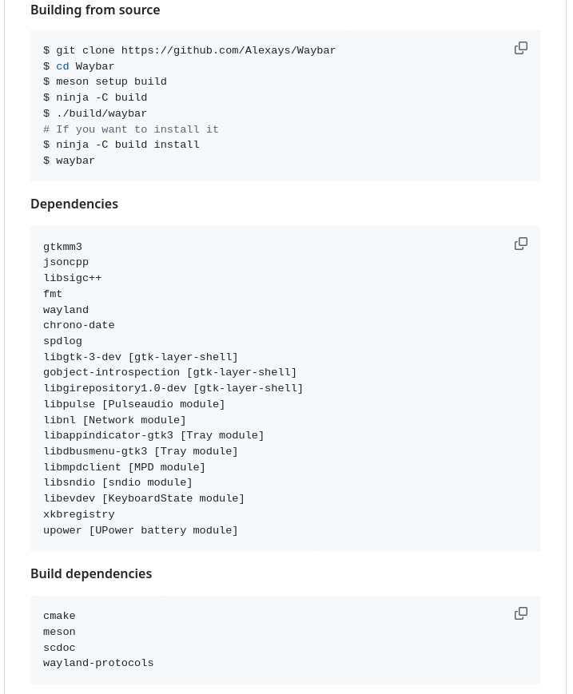
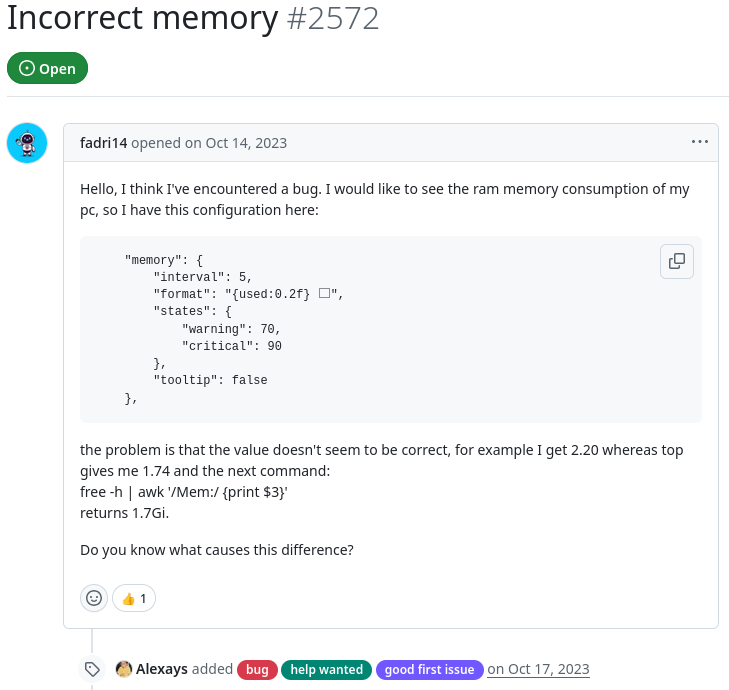
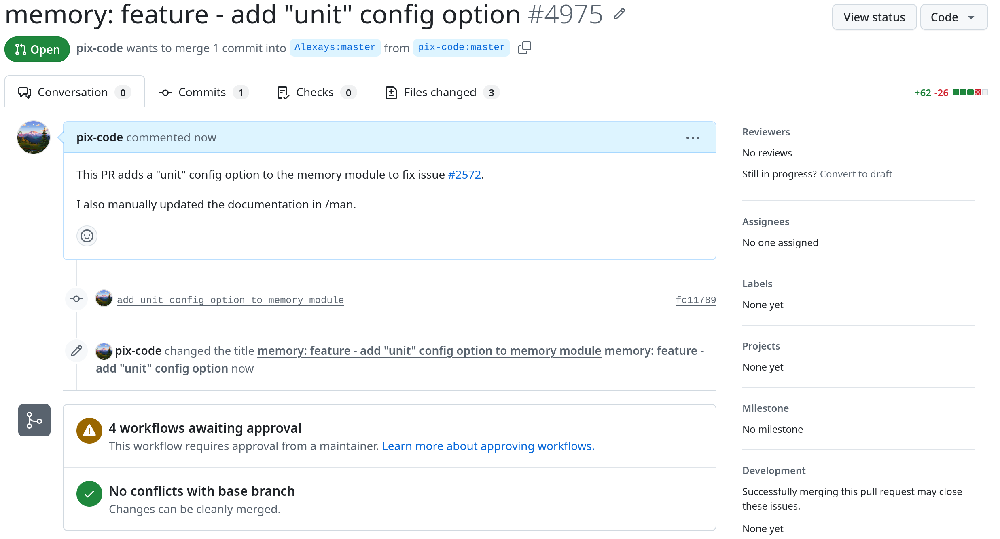
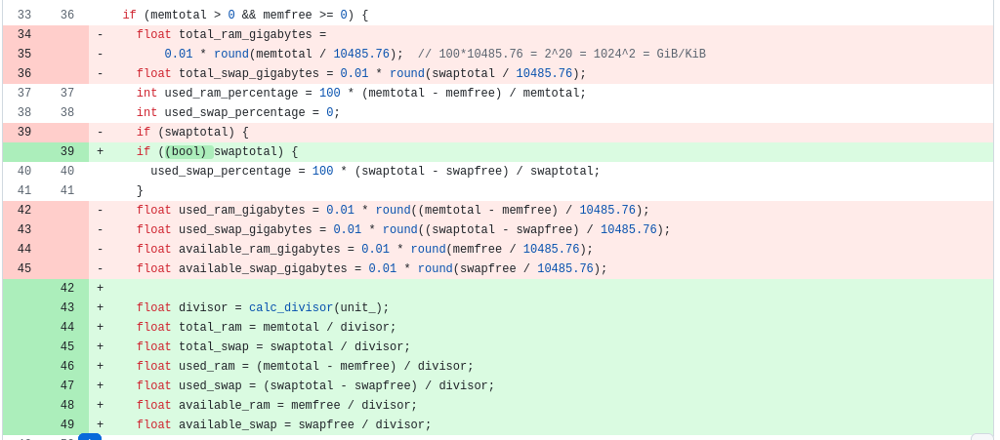

For my contribution I decided to fix an issue in [waybar](https://github.com/Alexays/Waybar). I have been using waybar on and off for the past couple of years and have gotten familiar with how it is used, so I thought it would be a good jumping off point into the FOSS community.

## What is Waybar?
Waybar is a "Highly customizable Wayland bar for Sway and Wlroots based compositors," pretty much just a status bar for wayland linux desktops. The segments of the bar are split into 'modules,' and each module can be customized and styled using configuration files. The modules can display information about the system, such as the current time, battery level, CPU usage, and memory usage.

## Getting involved
In order to involve myself with the project, I looked over the documentation for the repo to find resources for contributors. The most helpful information I gained from this step was a guide on how to build the project from source, as well as some general reccomendations for new contributors which mentioned to look for issues with the 'good first issue' tag.

## The Issue
When thinking about what to contribute to the project, I found an [issue](https://github.com/Alexays/Waybar/issues/2572) from 3 years ago (!?) that was still open about the confusing units used in the memory module. When I recently reconfigured my own setup, I noticed the same issue so I thought it would be a good issue to tackle. In short, the units used for the memory dispay were hard coded to be gibibytes despite other modules such as the disk module having customizable units. To fix this, I decided to add a configuration option to the memory module to allow for the same level of customization.

## The Experience
Following the documentation on how to build the code from source, I got a development build up and running. I did a few simple tests to figure out how the code worked, and then focused my effort on adding the feature. Since the feature I wanted to implement was already working in the disk module, I based my work off of what was completed there. I added the configuration option to the memory module class and implemented a function to convert the configuration option into a divisor to apply to the current system memory. Afterwards I committed my work and submitted a [pull request](https://github.com/Alexays/Waybar/pull/4975), which as of the time of writing has not been accepted yet.

