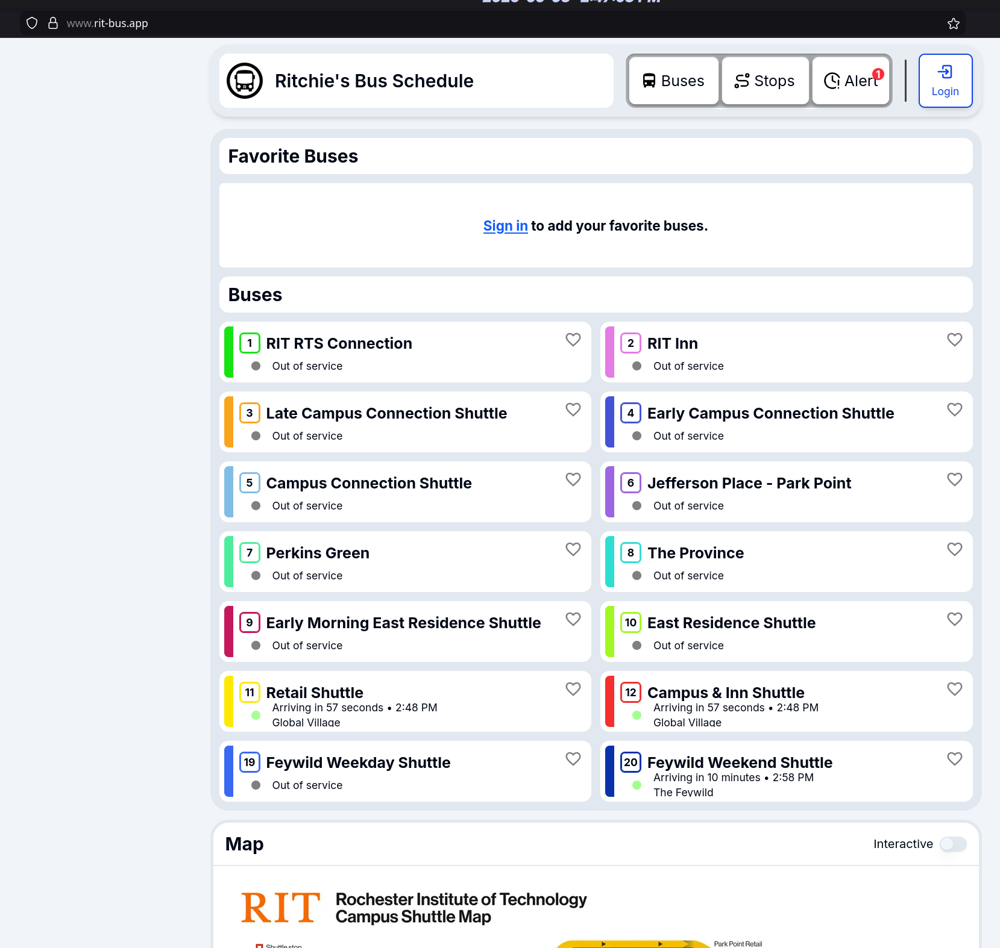
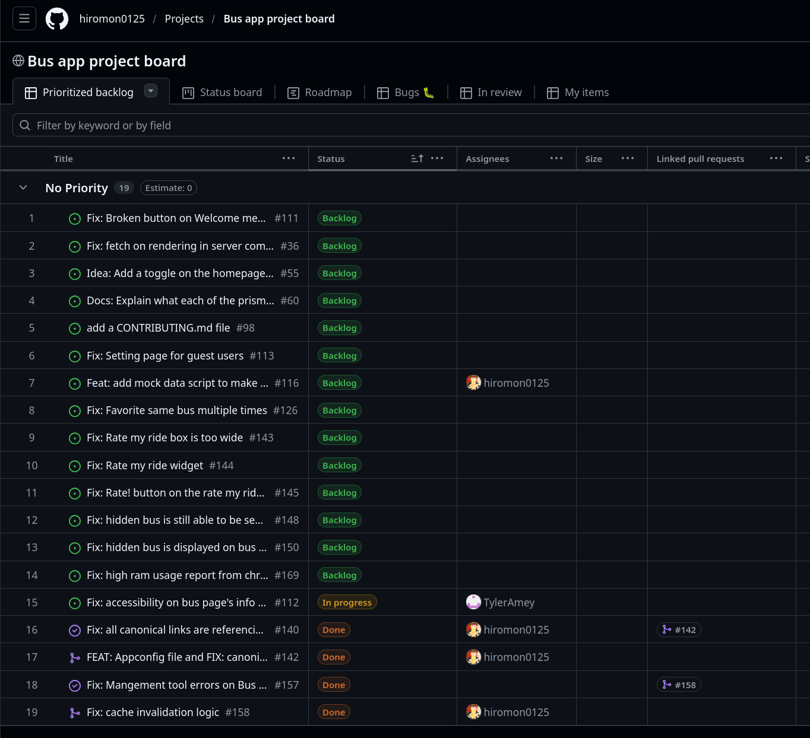
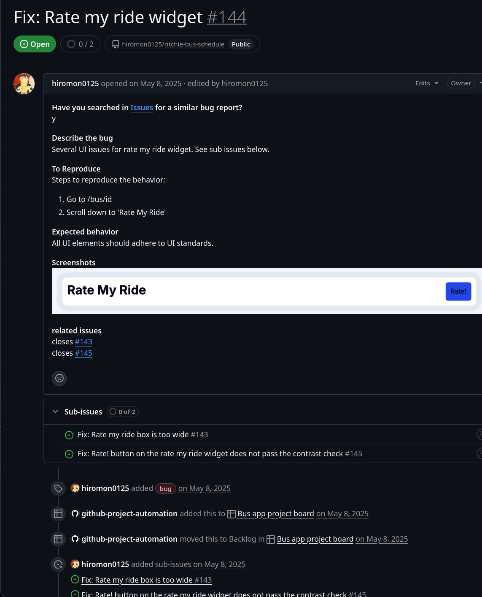
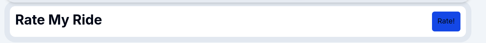
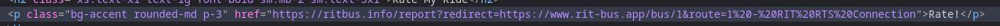
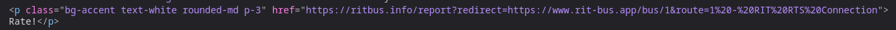

# Picking Ritchie's Bus App

I picked Ritchie's Bus App for my contribution because I know few people who use it to track their bus schedule. I do see that it has not really been maintained for a while so I am hoping that a contribution can get it back up and running.

# Contributing to Ritchie's Bus App

It was easy to find an issue to work on as the maintainer had a project board for the repository.

I looked for simple UI issues so I can get a better understanding of the codebase and I saw this issue:

# Working on the issue

I looked for the "Rate!" button in the HTML/CSS and messed with the parameters. Adding "text-white" fixes the issue.

# How much effort did this assignment require?

The contribution itself was fairly low effort.