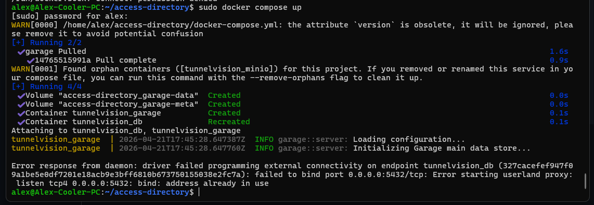
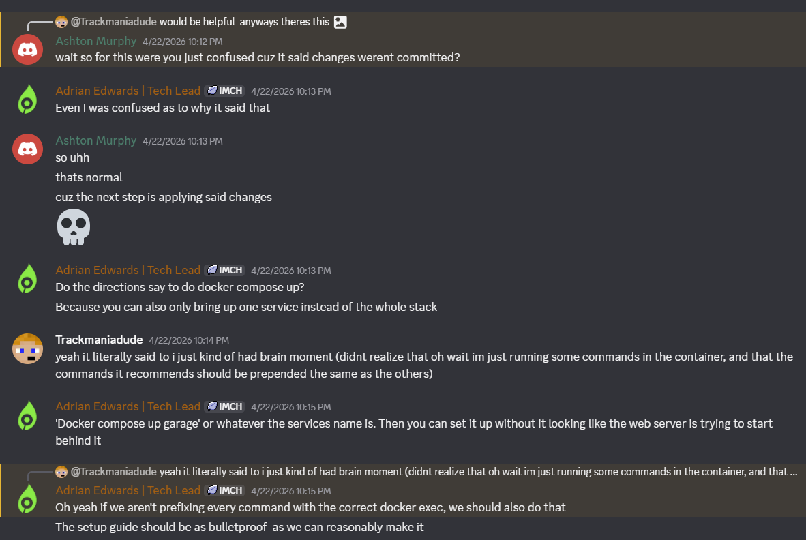

### THE PROJECT
CampusPulse Access is an accessibility tool for Rochester Institute of Technology, providing a catalog of all accessibility devices (elevators, door openers) to allow people to easily check the state and location of such devices.

I went for this project mostly because of a lower social barrier (I directly knew people involved, easier to open conversation)

### ISSUE
I <i>was</i> going to tackle an actual (listed) issue, however things ended up being somewhat wonky with the setup. What I instead ended up on was a recent update to the onboarding documentation (which also included a migration of one of the tech stack elements), which had, of the time, not been externally verified to work. So the issue was simply one of replication.

### ACTIONS
I followed the instructions for the new version of the onboarding documentation. This <i>mostly</i> worked, but not without some hangups, which I communicated to the people implementing the documentation change, and we talked to figure out which ones actually made since to note down/were likely issues for people to hit.

One thing I hit was the docker image not starting properly, due to a port collision. We figured this was probably just an issue on my end. The other was the guide not being quite thorough enough for someone to be able to blindly follow (as is likely for new people unfamiliar with the tech stack). We decided this could be clarified, even if it's not too necessary (because its ultimately a "user failed to read" thing).

One of the issues we determined was most likely a me issue and not a likely to happen issue.

Discussion about clarifying one of the steps, which did not exactly describe how it would normally go.

### CONCLUSION

I learned that the hardest part for me is interacting with people. Coding is easy. Figuring out the social structures that allow me to say "hi, this thing is cool, can I help?" are far harder. Or asking for help in getting the thing running so I can actually do something.

And that even just interacting can sometimes be of use.