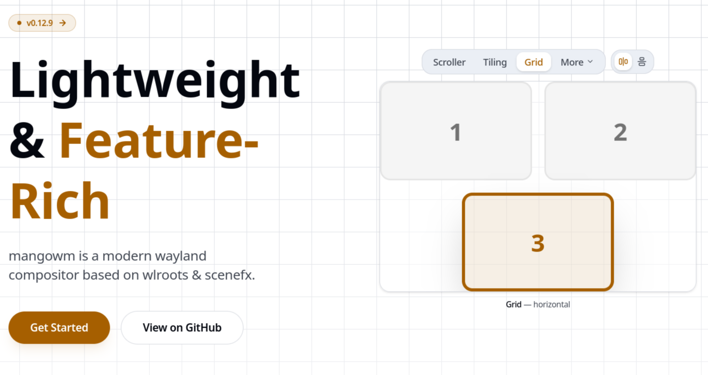
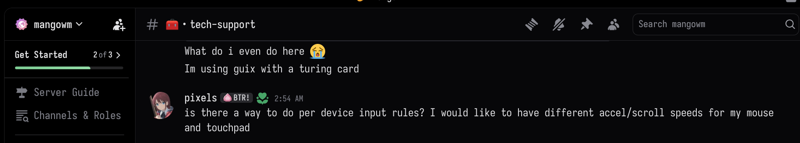
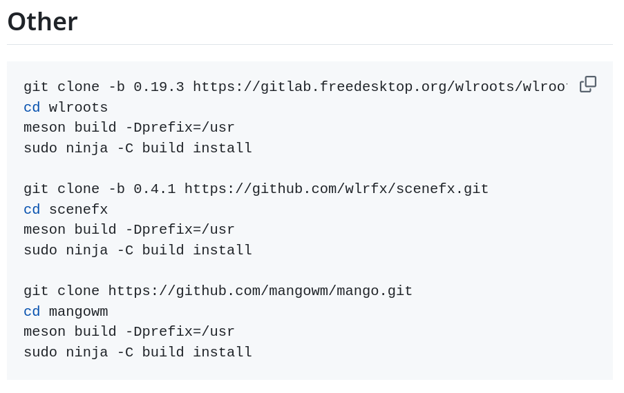
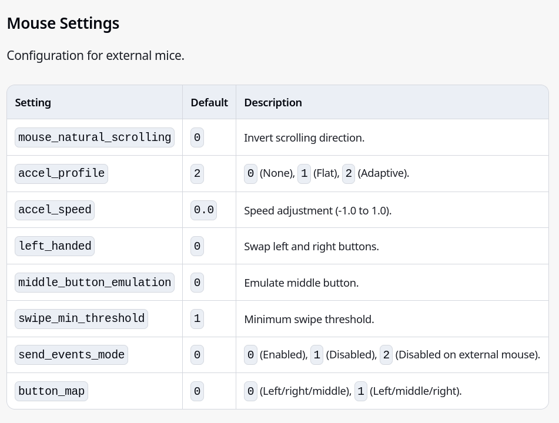
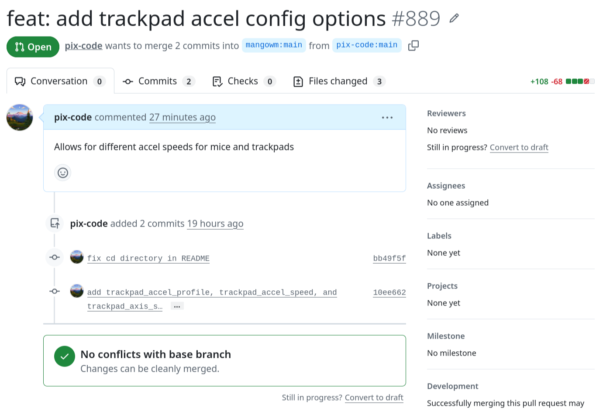

For my second contribution, I wanted to take on something a little larger than my first one. After bouncing around a couple of projects, I decided to focus on [mango](https://github.com/mangowm/mango), a tiling wayland linux compositor based on dwl. I recently switched to it, but was annoyed at how it treated mouse and trackpad sensitivity the same (meaning my trackpad would move the cursor too slowly while my mouse would move it too fast) and decided to make some changes to fix this issue.

## What Is Mangowm?
Mangowm (aka mangowc and just mango) is a "modern wayland compositor based on wlroots & scenefx." It is a fork of DWL, an implementation of a wayland compositor using suckless philosophies in the vein of DWM, which used X11. It is more lightweight than something like hyperland, but because it is a newer project it has less features.

## Getting Involved
To engage in the community, I first joined the discord server and asked some questions about if the feature I wanted to implement was already in the codebase (as a sanity check, I never got a response though). Then I checked if there were any issues or pull requests to address the feature (there werent), and quickly set off to find build instructions. After finding the right instructions (fixing a small issue in the readme along the way) I installed the needed dependencies and built the project without any major problems.

## The Issue
As mentionend before, mice and trackpads share the same acceleration profile and speeds in the configuration file, so I wanted to add three more options (trackpad_accel_profile, trackpad_accel_speed, and trackpad_axis_scroll_factor) to fix this. Working with the codebase was relatively simple since the entire compositor is pretty much implemented in one c file (albeit one that is almost 7,000 lines long) and I was able to figure out how to add my features and a couple of helper functions while testing my alterations out along the way. After making my changes, I pushed them to my fork and opened a [pull request](https://github.com/mangowm/mango/pull/889) which will hopefully be accepted in the future. In the meantime, I will definately be using my local version because of the new feature.

## The Experience
Overall making this change was a lot simpler than I thought it would be at first due to the suckless philosophy surrounding the project, and I highly reccomend using and contributing to this project if you are interested in tiling wayland compositors like I am!

