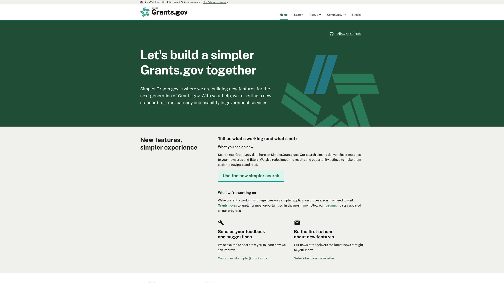
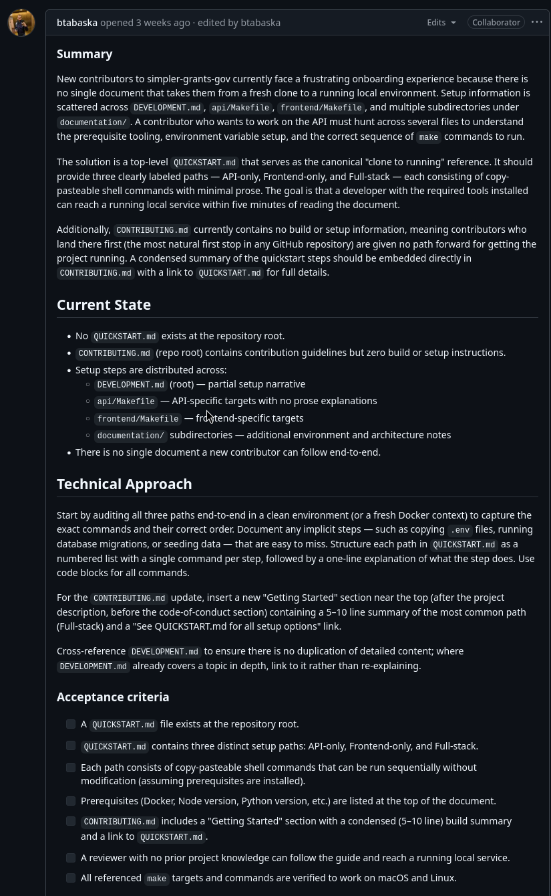
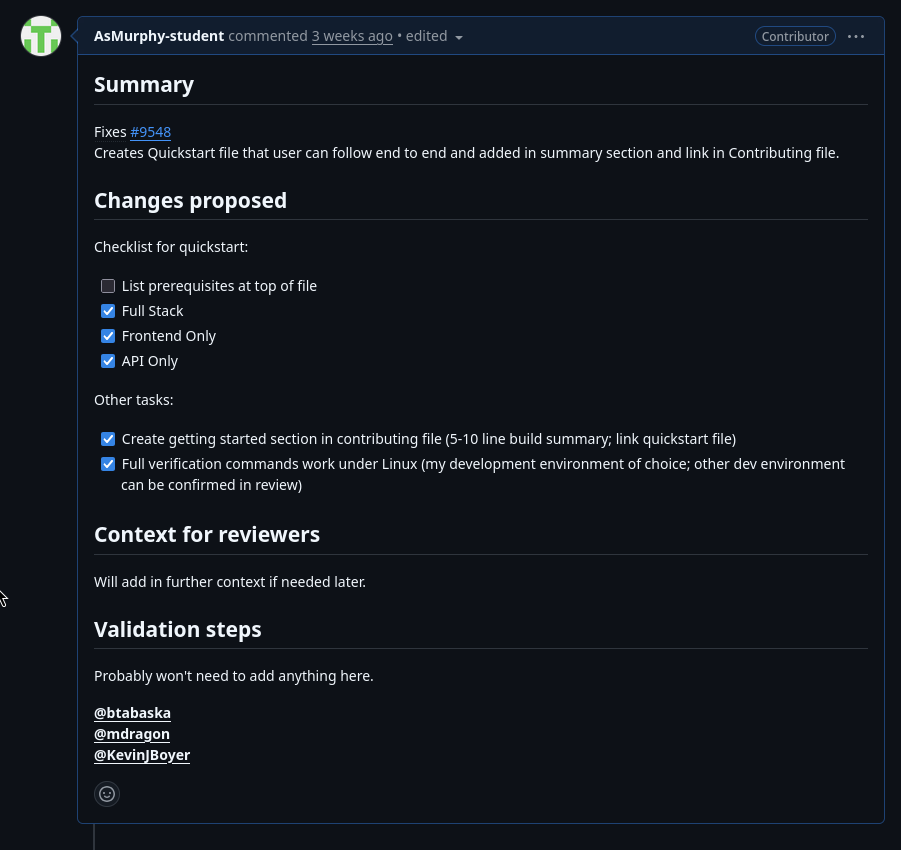

## SimplerGrants Introduction

SimplerGrants is an open source tool to help people be able to search for and apply to grants. It aims to create a simpler application process for grants, and make them easier to navigate and read effectively.

_Main page of SimplerGrants_

I chose this project as it has some good issues that I can tackle, and I tackled some small issues already for this project. I also had completed some small issues prior.

## The Issue and Contribution

This issue I decided to tackle was an issue to streamline the onboarding process for newcomers to contributing to SimplerGrants, and more specifically, the setup for the development environment for the project.

I went ahead and created a new quickstart documentation file in markdown for setting up SimplerGrants locally for development. I did this for frontend, API, and Full Stack (both frontend and API). I followed the criteria for the opened [issue](https://github.com/HHS/simpler-grants-gov/issues/9548) for creating the [PR](https://github.com/HHS/simpler-grants-gov/pull/9606).

_The associated issue and the acceptance criteria_

_The PR I created which is still in the process of being merged_

Currently, this PR is still open and the only thing blocking me is ensuring the prerequisites are correct for development setup which I am currently sorting for this to properly get merged.
