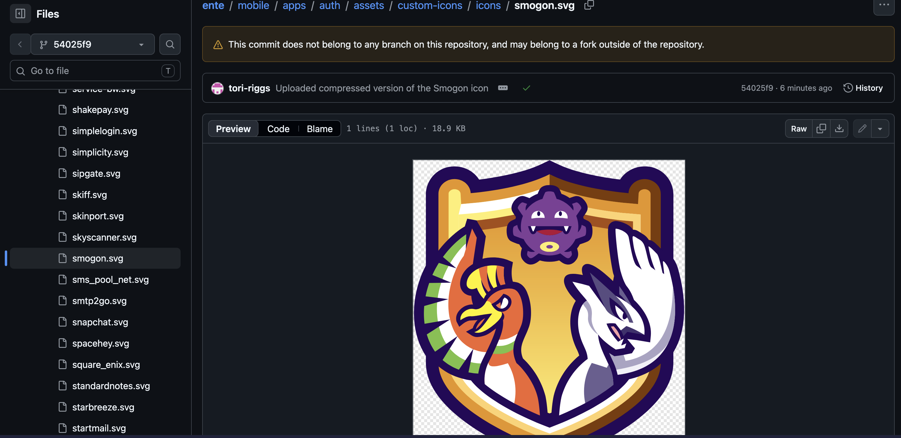
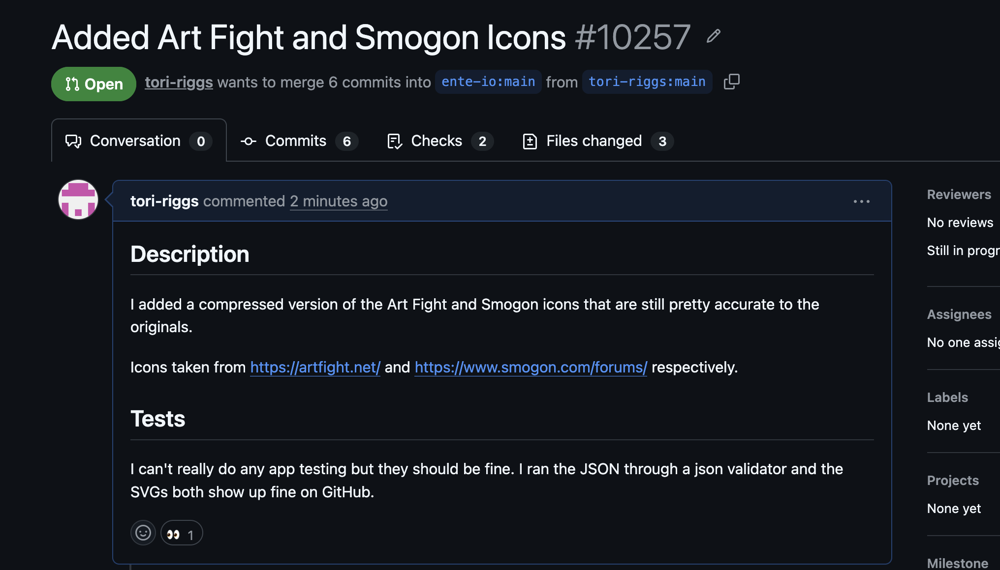
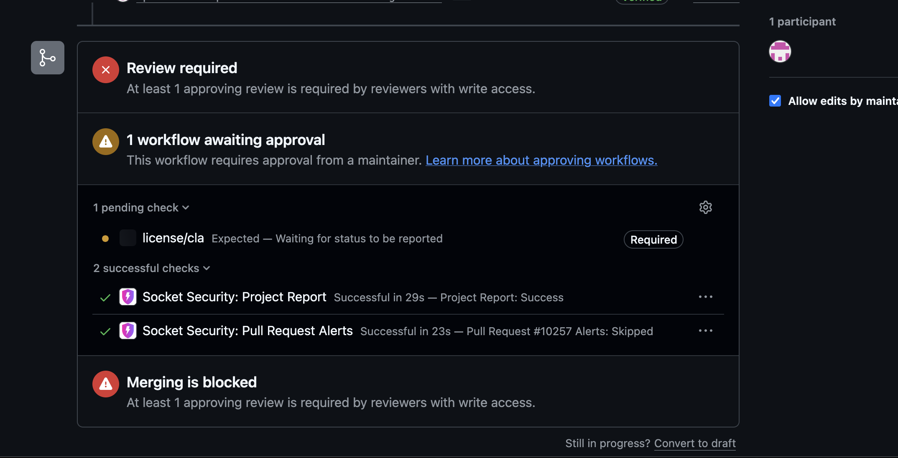

For my second contribution, I contributed to [ente](https://github.com/ente-io/ente)'s 2FA app by adding icons for the websites Smogon and Art Fight.

## What is Ente Auth?

Ente Auth is a free and open-source 2FA app.

## Why did you pick it?

I use Ente Auth for my 2FA tokens. I also have accounts on Smogon and on Art Fight, and I was annoyed that the icons for them were blank. I tried making a contribution and adding them back in August, but the files for those two websites were eventually deleted for being too large. I've been meaning to try again but I haven't gotten around to it until now.

## How did your CommArch experience show you it would be good to work with?

I had a good experience contributing to them before.

## What resources were already available?

It has a [short document describing how to contribute custom icons](https://github.com/ente-io/ente/blob/main/mobile/apps/auth/docs/adding-icons.md) linked in its CONTRIBUTION.md. It explicitly states that they do not accept SVGs that are greater than 20 KB. Both Art Fight and Smogon have complicated SVGs that were over 20 KB. I had to find a way to compress them, so I went to Google.

## The Contribution

I found the icons on the websites for Smogon Forums and Art Fight and downloading them. I've experimented with opening them in Inkscape and using the optimized SVG file format to compress them. No matter what I did, it was still over 20 KB for both of them. With Smogon, I gave up with getting the entire SVG done and tried getting part of it instead, which did work. I had to experiment far more with Art Fight because it kept getting down to 24 KB, but no larger than that.

These are the (now compressed) screenshots of the icons I was trying to contribute.

As you can see, they are both very detailed logos.

I finally tried using an actual website dedicated to compressing SVGs, and I found [SVGOMG](https://svgomg.net/). It wasn't getting Art Fight's icon below 20 KB...until I tried lowering the number precision down from 3 to 2. That made a massive difference in the file size and I couldn't even see any difference from the original!

That was when I decided to try running the Smogon icon through this website and lowering the number precision. I had to lower it from 3 to 1 to get it below 20 KB. I was able to notice a change in the lineart for Koffin (the purple Pokemon in the center), but it didn't look bad in any way and probably wouldn't even be noticed unless you were actively looking for a difference.

When I made my pull request, I had to agree to the CLA through a website called [cla-assistant.io](https://cla-assistant.io/ente-io/ente?pullRequest=10257). I have never heard of this website before now, so that was interesting. Thankfully, it was only a few clicks to sign in with my GitHub account and hit "agree."

## Response to the Contribution

I am still waiting for approval from the maintainers. There has been no other response as I just made the PR.

Link: [https://github.com/ente-io/ente/pull/10257](https://github.com/ente-io/ente/pull/10257)

